# Processing Pipeline

Step-by-step flows for each operation mode in make-help.

## Table of Contents

- [Static Help File Generation Flow (Default)](#static-help-file-generation-flow-default)
- [Dynamic Help Display Flow](#dynamic-help-display-flow)
- [Detailed Target View Flow](#detailed-target-view-flow)
- [Remove Help Files Flow](#remove-help-files-flow)

---

## Overview



<!-- AI readable version of SVG diagram: diagrams/cli-mode-routing.mmd -->

### 1 Static Help File Generation Flow (Default)

```
1. CLI Parsing
   ├─> Parse flags and validate
   ├─> Resolve Makefile path (cwd/Makefile or --makefile-path)
   ├─> Detect color mode (terminal detection + flags)
   └─> Build Config object

2. Discovery Phase
   ├─> Discover Makefiles (MAKEFILE_LIST)
   │   ├─> Generate temporary Makefile with _list_makefiles target
   │   ├─> Execute: make -f <temp> _list_makefiles
   │   └─> Parse space-separated output -> []string
   └─> Discover Targets (make -p)
       ├─> Execute: make -f <makefile> -p -r
       └─> Parse database output -> []string

3. Parsing Phase
   ├─> For each Makefile in discovery order:
   │   ├─> Scan line-by-line
   │   ├─> Detect ## documentation lines
   │   ├─> Parse directives (!file, !category, !var, !alias)
   │   ├─> Detect target definitions (lines with :)
   │   └─> Associate pending docs with targets
   └─> Result: []*ParsedFile

4. Model Building Phase
   ├─> Aggregate directives from all files
   ├─> Group targets by category
   ├─> Validate categorization (no mixing unless --default-category)
   ├─> Associate aliases and variables with targets
   └─> Result: *HelpModel

5. Ordering Phase
   ├─> Apply category ordering
   │   ├─> If --category-order: explicit order + alphabetical remainder
   │   ├─> Else if --keep-order-categories: discovery order
   │   └─> Else: alphabetical
   └─> Apply target ordering (within each category)
       ├─> If --keep-order-targets: discovery order
       └─> Else: alphabetical

6. Summary Extraction Phase
   ├─> For each target:
   │   ├─> Join documentation lines
   │   ├─> Strip markdown headers
   │   ├─> Strip markdown formatting
   │   ├─> Strip HTML tags
   │   ├─> Normalize whitespace
   │   └─> Extract first sentence (regex)
   └─> Update target.Summary

7. Formatting Phase
   ├─> Initialize ColorScheme (no colors for static output)
   ├─> Render help text as lines
   ├─> For each line, create @echo statement
   └─> Result: array of formatted lines

8. Static File Generation
   ├─> Generate file header comment
   ├─> Create help target with @echo statements
   ├─> For each documented target:
   │   └─> Create help-<target> target with @echo statements
   ├─> Add auto-regeneration target (help.mk: Makefile)
   │   ├─> Try: command -v make-help
   │   ├─> Fallback: npx -y @sdlcforge/make-help
   │   └─> Error: Show installation instructions
   └─> Result: complete help.mk content

9. File Writing
   ├─> Determine target file location
   │   ├─> If --help-file-rel-path specified: use it
   │   ├─> Else: default to make/ directory
   │   │   ├─> Scan Makefile for include pattern (include make/*.mk)
   │   │   ├─> Extract suffix from pattern (e.g., ".mk" or "")
   │   │   ├─> Scan make/ directory for numbered files (e.g., "10-foo.mk")
   │   │   ├─> Determine prefix: "00-", "000-", or "" based on existing files
   │   │   ├─> Generate filename: {prefix}help{suffix}
   │   │   └─> Example: "make/00-help.mk" or "make/help.mk"
   │   └─> Create make/ directory if it doesn't exist
   ├─> If --dry-run: preview content and exit
   ├─> Write file atomically (temp file + rename)
   ├─> Add include directive to Makefile if needed
   │   ├─> For make/ directory: add "-include make/*.mk" if no pattern exists
   │   └─> For other locations: add "-include $(dir $(lastword $(MAKEFILE_LIST)))path"
   └─> Success message
```

### 2 Dynamic Help Display Flow

```
1. CLI Parsing
   ├─> Parse --show-help flag
   ├─> Validate flag combinations
   └─> Build Config object

2-6. [Same as Static Help File Generation Flow steps 2-6]
   Discovery → Parser → Model → Ordering → Summary

7. Formatting Phase
   ├─> Initialize ColorScheme based on config.UseColor
   ├─> Render usage line
   ├─> Render file docs
   ├─> Render "Targets:" header
   ├─> For each category:
   │   ├─> Render category name (if not default)
   │   └─> For each target:
   │       ├─> Render target name + aliases
   │       ├─> Render summary
   │       └─> Render variables (if any)
   └─> Result: formatted string

8. Output
   └─> Write to STDOUT
```

### 3 Detailed Target View Flow

```
1. CLI Parsing
   ├─> Parse --show-help and --target flags
   ├─> Validate that --target requires --show-help
   └─> Build Config object

2-6. [Same as Dynamic Help Display Flow steps 2-6]

7. Find Target in Model
   ├─> Search all categories for target by name
   ├─> If not found: error
   └─> Extract target details

8. Render Detailed View
   ├─> Render target name
   ├─> Render full documentation (all lines)
   ├─> Render aliases section (if any)
   └─> Render variables section (if any)

9. Output
   └─> Write to STDOUT
```

### 4 Remove Help Files Flow

```
1. CLI Parsing
   ├─> Parse --remove-help flag
   └─> Resolve Makefile path

2. Remove Include Directives
   ├─> Read Makefile
   ├─> Filter out lines matching: ^include\s+.*help.*\.mk
   ├─> Write back atomically
   └─> Report if any directives removed

3. Remove Inline Help Targets
   ├─> Read Makefile
   ├─> Detect help: target and .PHONY: help
   ├─> Skip target and its recipe lines (tab/space-prefixed)
   ├─> Write back atomically
   └─> Report if any targets removed

4. Remove Help Files
   ├─> Check for help.mk in project root
   │   └─> Delete if exists
   ├─> Check for make/help.mk
   │   └─> Delete if exists
   └─> Report files removed

5. Success
   └─> Print confirmation message
```


Last reviewed: 2025-12-25T16:43Z
